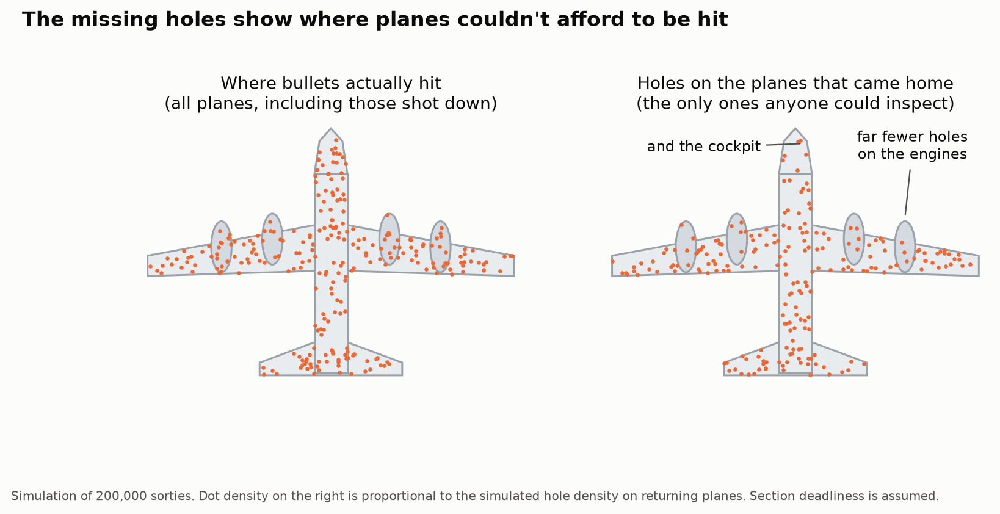
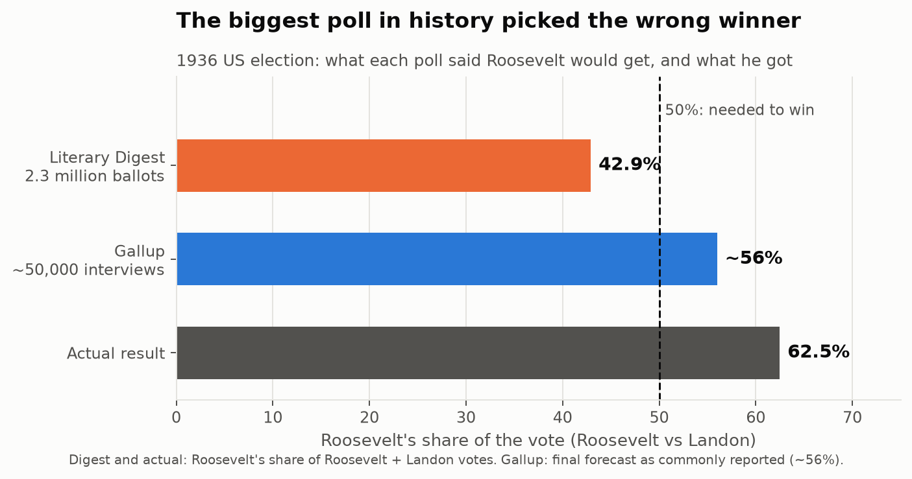
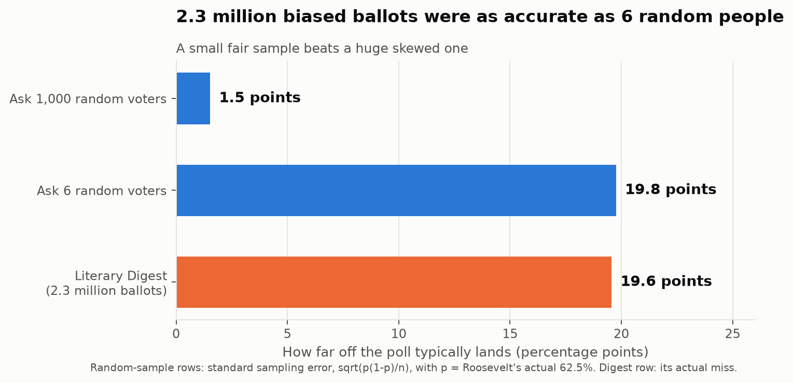
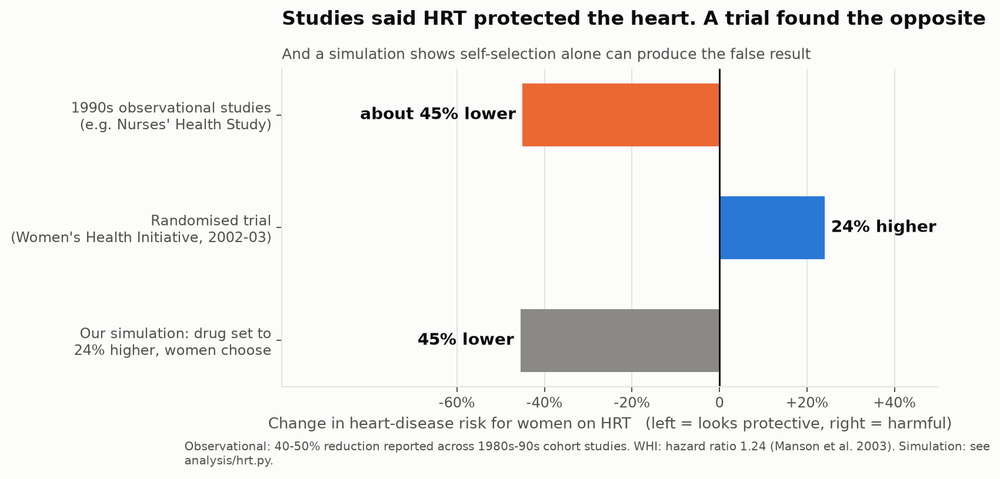
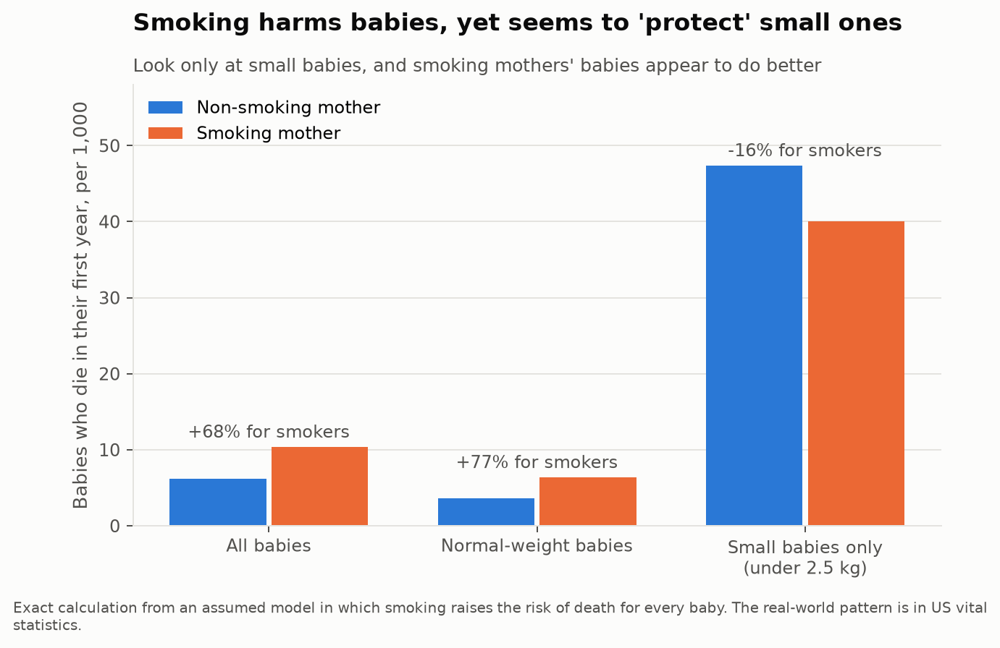
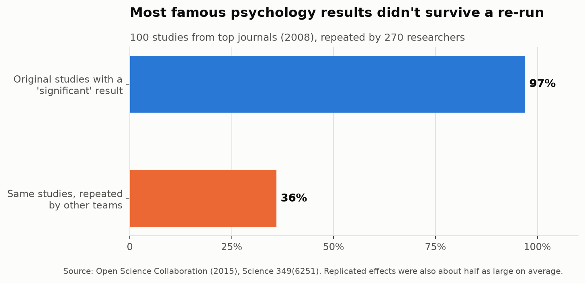
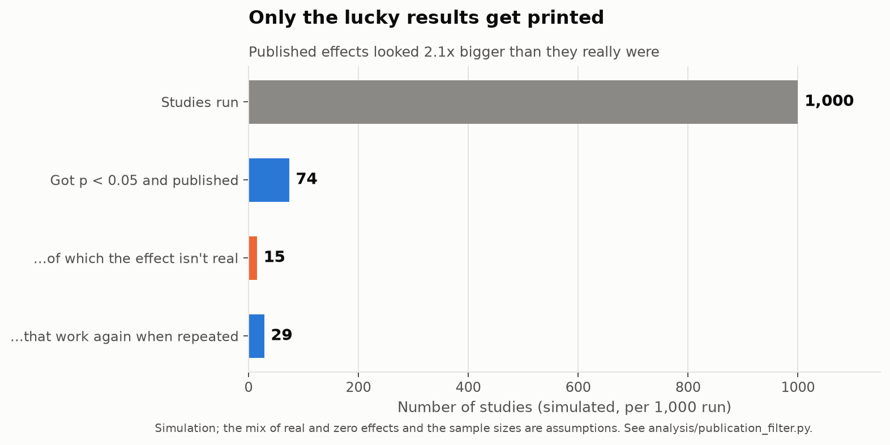
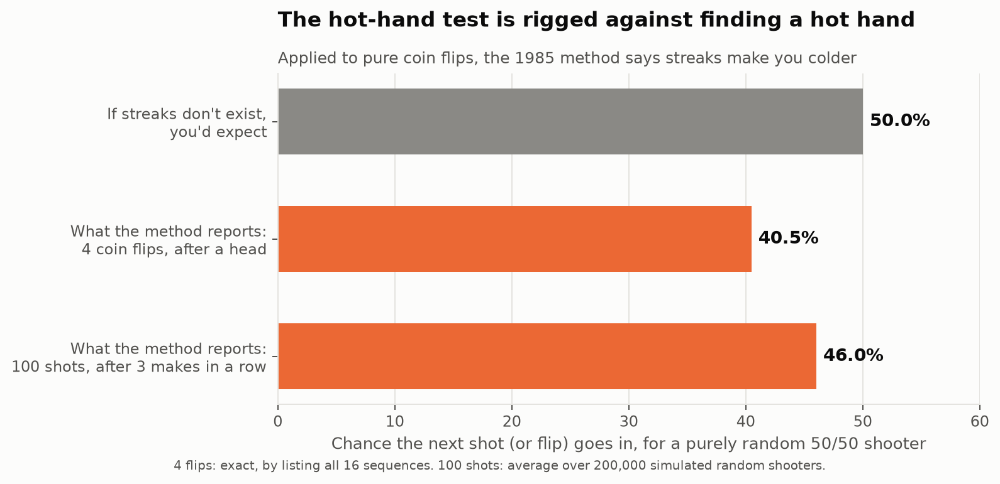

# The Data Was Lying About Who It Left Out

### Six famous studies that went wrong for the same simple reason

In July 2002, news broke that surprised doctors across America. A huge government trial of hormone replacement therapy, a drug millions of women took partly *to protect their hearts*, had been stopped early. The drug wasn't protecting hearts. It was slightly raising the risk of heart disease.

For twenty years, study after study had said the opposite. Those studies weren't faked, and the researchers weren't careless. They all made the same quiet mistake, and it's one you've probably made yourself this week.

It's called **selection bias**, and once you see it you'll notice it everywhere.

---

## First: what is selection bias?

**Selection bias happens when the people (or things) in your data aren't a fair picture of the group you actually care about, because of *how they got into your data*.**

Think of every dataset as a club with a bouncer at the door. Before anyone does any maths, the bouncer has already decided who gets counted. If the bouncer lets people in for a reason connected to the question you're asking, your answer will be wrong. It doesn't matter how carefully you do the maths afterwards.

You already know this from everyday life:

- **Online reviews.** Mostly people who loved a place or hated it bother to write one. The quietly satisfied majority stays home. So reviews look more extreme than the real experience.
- **"They don't make them like they used to."** The 50-year-old fridge still humming in your grandmother's kitchen feels like proof that old fridges were better. But you never see the millions of 1970s fridges that broke and went to the dump. Only the toughest ones survived long enough for you to meet them.
- **"Bill Gates and Mark Zuckerberg dropped out of college."** True. You don't hear about the thousands of dropouts whose startups failed, because nobody writes profiles of them.

In each case, the data you see has already been filtered. The scary part is that **collecting more of the same data never fixes it.** A million reviews from the same angry-or-delighted crowd are still skewed.

Below are six famous studies, from war planes to basketball, where that filter fooled smart people. For each one I wrote code to show what went wrong, using real published numbers where they exist. (There's a note at the end on what's real and what's simulated.)

---

## 1. The bombers that came home (World War II)

**The setting.** By 1943, American and British bombers were being shot down over Europe in huge numbers. Armour could protect them, but armour is heavy: too much, and the plane is slower, burns more fuel, and carries fewer bombs. So the question was **where to put a limited amount of armour.**

In New York, a secret team of mathematicians called the Statistical Research Group was working on problems like this for the military. One of them was **Abraham Wald**, a Hungarian-born statistician who had fled the Nazis.

**The obvious answer.** Look at the planes coming back from missions, see where they have the most bullet holes, and armour those spots.

**What went wrong.** The planes being examined were only the ones that *made it home*. A plane hit in the engine often didn't come back, so it never got counted. The holes on returning planes showed where a plane **could take a hit and still fly**. The places with *few* holes, like the engines and cockpit, weren't safe. They were where hits brought planes down.

I simulated 200,000 bombing missions. In the simulation, bullets hit every part of the plane equally often. Then I looked only at the planes that returned:

On the returning planes, the engines show **less than half** the holes they actually took. The wings show *more* than they really took, because planes hit there kept flying home. An analyst reading the right-hand picture would armour exactly the wrong places.

Wald's real contribution was going further than "look where the holes aren't." He worked out the maths to estimate **how deadly a hit to each part was**, using only the survivors. When I apply his method to the simulated survivors, it recovers the true numbers almost perfectly. For example, it estimates that 60% of engine hits bring a plane down, and the true figure in the simulation is 60%.

> **A fair footnote:** the tidy "armour where the holes aren't" story is a later retelling. What survives from 1943 is a set of eight technical memos by Wald, published properly in 1984. The maths is real. The famous scene may be polished.

**The everyday version:** gyms, coaching programmes and diets that show you only their success stories.

---

## 2. The biggest poll in history (1936 US election)

**The setting.** *The Literary Digest* was one of the most popular magazines in America, and it was famous for one thing: calling presidential elections. It had picked the winner every time from 1920 to 1932.

In 1936, President Franklin Roosevelt was running for re-election against Republican Alf Landon. The Digest went bigger than ever. It mailed out **10 million ballots**, using lists of telephone owners, car owners and its own subscribers. About **2.4 million** came back.

**What they concluded.** Landon would win comfortably.

**What actually happened.** Roosevelt won one of the biggest landslides in American history. He carried 46 of 48 states.

Meanwhile, a young pollster named **George Gallup** interviewed only about 50,000 people, chosen to reflect the whole country, and correctly predicted a Roosevelt win.

**What went wrong.** There were two filters, one after the other:

1. **Who got a ballot.** In the middle of the Great Depression, owning a phone or a car meant you were better off than most Americans. Better-off voters leaned towards Landon.
2. **Who bothered to send it back.** Only about 1 in 4 people returned their ballot. People angry with the government (Landon supporters) were keener to reply than people who were content. Later research suggests this second filter did even more damage than the first.

Here's the number that should stick with you. A poll of random voters has a predictable typical error, and the bigger the sample, the smaller it gets. So we can ask: **how small would a fair, random poll have to be to make an error as big as the Digest's?**

The answer is about **six people.** The Digest's 2.3 million ballots were, in accuracy terms, worth about as much as stopping six random people in the street. The magazine never recovered its reputation and closed within two years.

**The everyday version:** an online poll on a news site, a Twitter poll, or "everyone I know is voting for X."

---

## 3. The heart pill that wasn't (hormone replacement therapy)

**The setting.** Hormone replacement therapy (HRT) is given to women around menopause to replace the hormones their bodies stop making. By the 1990s it was hugely popular. From 1992 to 2001, Premarin, the leading brand, was **the most prescribed drug in the United States.**

Part of the reason was the heart. Large, long-running studies followed thousands of women for years. The most famous was the **Nurses' Health Study**, which began tracking about 120,000 American nurses in 1976. Those studies found that women who took HRT had roughly **40–50% less heart disease** than women who didn't. Many doctors recommended HRT partly to protect the heart.

**What went wrong.** These studies were *observational*: researchers watched what women chose to do, and compared those who took HRT with those who didn't. But the women who chose HRT were different to begin with. On average they were wealthier, better educated, thinner, more likely to exercise, more likely to see a doctor regularly, and more likely to take their medicine as told. In short, **healthier women chose HRT, and HRT got the credit for their health.** This is sometimes called the "healthy user" effect.

The only way to rule that out is a **randomised trial**: flip a coin to decide who gets the real drug and who gets a dummy pill. Then the two groups are alike in every way except the drug.

**What the trial found.** The Women's Health Initiative enrolled **16,608 women**, randomly split between HRT and a dummy pill. In July 2002 it was stopped early: women on HRT had more breast cancer, more strokes, more blood clots, and **24% more heart disease** (in the final analysis). Sales of Premarin fell by more than half within two years.

I wanted to check whether self-selection alone could explain the flip. So I simulated a population in which **HRT is harmful, raising heart risk by 24%**, the same as the trial found. The only other thing I built in was that healthier women were more likely to choose it. Then I analysed it the way the observational studies did:

The comparison of choosers against non-choosers made the harmful drug look like it cut heart disease by **45%**, almost exactly what the real studies reported. Adjusting for things the researchers could measure narrowed the gap but never flipped it back to harmful. You can't adjust for differences you didn't measure.

> **For accuracy:** epidemiologists would usually file this under "confounding" rather than "selection bias" in the strictest sense. The root cause is the same: the people in each group chose themselves.

**The everyday version:** "People who drink red wine / take vitamins / eat organic live longer." Often, people who were going to live longer anyway are the ones who choose those things.

---

## 4. Smoking that seemed to protect babies

**The setting.** It's long been known that babies born small (under 2.5 kg, or about 5.5 lb) are at higher risk of dying in their first year, and that **mothers who smoke tend to have smaller babies.** Smoking is clearly bad for babies.

But in 1971, a researcher named **Jacob Yerushalmy** spotted something odd. When he looked **only at small babies**, the babies of smoking mothers were *less* likely to die than the babies of non-smoking mothers. The pattern turned up again and again in US birth records. Taken at face value, it says smoking *protects* small babies. It doesn't, and the puzzle became known as the **birth-weight paradox**.

**What went wrong.** A baby can be small for different reasons:

- **Because the mother smoked.** Smoking makes babies smaller, but these babies are often otherwise healthy.
- **Because of something far more dangerous**, like a serious birth defect or a severe medical problem.

If you look only at small babies, the non-smoking mothers' small babies are more likely to be small *for the dangerous reason*. After all, smoking isn't there to explain why they're small. So the non-smokers' group is loaded with the most at-risk babies. The filter "only look at small babies" creates the false pattern. Researchers Sonia Hernández-Díaz, Enrique Schisterman and Miguel Hernán laid this out clearly in 2006.

I built a simple model in which **smoking raises the risk of death for every baby, with no exceptions**, and calculated the result exactly:

Across all babies, smokers' babies die **68% more often**. Among normal-weight babies, **77% more often**. But among small babies only, smokers' babies appear to die **16% less often**. In the model, 17% of non-smokers' small babies have a serious defect, compared with only 10% of smokers' small babies. That difference alone creates the illusion.

**The everyday version:** "Among hospital patients, smokers do better after a heart attack." Hospital patients are already a filtered group: everyone in it got sick for *some* reason.

---

## 5. Why famous psychology findings keep falling apart

**The setting.** You may have heard of "power posing" (standing like a superhero makes you more confident) or the idea that willpower is a muscle that runs out. These were famous psychology findings, featured in bestsellers and TED talks. Many of them have since failed when other scientists tried to repeat them.

In 2015, a group of **270 researchers** decided to test this systematically. They took **100 studies** published in 2008 in three of psychology's top journals and repeated each one as closely as possible.

In the original papers, **97%** reported a "significant" result (meaning the effect was unlikely to be a fluke). When the studies were repeated, only **36%** did. And even when the effect showed up again, it was on average **only about half as big**.

**What went wrong.** Science journals have their own bouncer. A study that finds an exciting effect gets published. A study that finds nothing usually ends up in a drawer. So the published record is a filtered sample of all the research that was actually done, and it's filtered towards results that were lucky.

Picture 20 research teams testing the same idea, which is actually false. By pure chance, about one of them will get a result that looks significant. That's the one that gets published, and the other 19 are never seen.

I simulated this with 200,000 small studies of mostly modest or zero effects. Only studies that crossed the usual "significant" line got "published." Then I repeated each published study:

Out of every 1,000 studies run, only **74** got published. **15** of those were reporting an effect that didn't exist at all. When repeated, only **29** worked again, about **39%**, very close to the real 36%. And the published effects looked about **twice as big** as they really were, again matching the real project.

No fraud is needed for any of this. The filter alone does it.

**The everyday version:** the stock-picking newsletter that only advertises its best calls, or a friend who only tells you about their good dates.

---

## 6. The twist: the scientists who debunked the "hot hand" fell for it too

**The setting.** Ask any basketball fan whether a player who has just made several shots in a row is more likely to make the next one, and they'll say yes. That's the **"hot hand."** In 1985, three psychologists, **Thomas Gilovich, Robert Vallone and Amos Tversky** (Tversky was a long-time collaborator of Nobel winner Daniel Kahneman), set out to test it.

First they asked fans: **91%** believed in the hot hand. Then they analysed shooting records from the Philadelphia 76ers and the Boston Celtics, and ran a controlled experiment with 26 Cornell University players taking 100 shots each.

Their method was simple. For each player, compare how often they scored **right after a run of hits** with how often they scored **right after a run of misses.** They found no difference, and concluded that the hot hand is an illusion: our brains see patterns in randomness. The paper became a classic. For over 30 years, "the hot hand fallacy" was taught as a textbook example of human irrationality.

**What went wrong.** In 2018, economists **Joshua Miller and Adam Sanjurjo** showed that the method itself was biased, in a way almost nobody had noticed. When you take a fixed set of shots and pick out *only the shots that come right after a streak*, you are filtering the data in a way that **makes streaks look like they end more often than they really do.**

You can check this yourself with a coin. Flip a fair coin 4 times. Look at every flip that comes right after a head, and write down what share of those were also heads. Do this for all 16 possible sequences, then average the answers:

| Sequence | Heads after a head | | Sequence | Heads after a head |
|---|---|---|---|---|
| HHHH | 3 of 3 | | THHH | 2 of 2 |
| HHHT | 2 of 3 | | THHT | 1 of 2 |
| HHTH | 1 of 2 | | THTH | 0 of 1 |
| HHTT | 1 of 2 | | THTT | 0 of 1 |
| HTHH | 1 of 2 | | TTHH | 1 of 1 |
| HTHT | 0 of 2 | | TTHT | 0 of 1 |
| HTTH | 0 of 1 | | TTTH | *(no flip follows a head)* |
| HTTT | 0 of 1 | | TTTT | *(no flip follows a head)* |

Average the 14 sequences that count, and you get **40.5%, not 50%.** A perfectly fair coin "looks" like it goes cold after heads. Why? Look at HHHH: it has three flips that follow a head, all heads, but it counts only *once* in the average, exactly as much as HTTT, which has a single flip after a head, and it's a tail. Streaky sequences get squeezed into one vote each, so continuing streaks are under-counted.

The same thing happens with realistic numbers of basketball shots:

For a purely random 50/50 shooter taking 100 shots, the 1985 method says they score only **46%** after three hits in a row, and that they score about **8 percentage points worse** after a run of hits than after a run of misses. That's for a shooter with no hot hand at all.

So when the original study found **no difference**, that wasn't evidence against the hot hand. A random shooter should have looked *colder* after streaks. Looking the same means the players were actually doing **better than random** after making shots. When Miller and Sanjurjo re-ran the original 1985 data with the bias corrected, they found real evidence of a hot hand.

How big the hot hand is in real games is still being argued about. But the most famous "proof" that it doesn't exist was itself a victim of a selection effect. The researchers who taught the world to spot statistical illusions fell for one.

---

## How to spot selection bias yourself

Next time you see a striking claim, ask these questions before you believe it:

1. **Who's missing?** Who couldn't, wouldn't, or didn't make it into this data? (The planes that were shot down. The voters who didn't reply.)
2. **Did people choose their own group?** If people decided for themselves whether to take the pill, eat the diet, or join the programme, they may have been different to begin with.
3. **Was the data filtered by the outcome?** Looking only at hospital patients, only small babies, only successful companies, or only published studies can manufacture patterns from nothing.
4. **Would a bigger sample actually help?** If the filter is the problem, more data just makes the wrong answer look more certain.
5. **Was anything randomised?** A coin flip is the most reliable way to stop people sorting themselves into groups.

---

## What's real and what's simulated

I want to be clear about what the code proves and what it illustrates.

- **Real, published numbers:** the Literary Digest's vote counts and the election result; the HRT findings (observational studies and the Women's Health Initiative trial); the 2015 psychology replication results; the 1985 hot-hand study and the 2018 correction.
- **Exact maths, no assumptions:** the "worth six voters" calculation, and the coin-flip bias in the hot-hand method.
- **Simulations built to show how the bias works:** the bombers, the HRT self-selection model, the birth-weight model and the publication filter. I chose the settings (for example, how deadly an engine hit is, or how much healthier HRT users were) so the results land near the real numbers. They show that the bias *can* produce what was observed. They aren't a re-analysis of the original data.

All the code is open: [link to repo]. Each case is a short Python file, and running `python analysis/run_all.py` regenerates every number and chart in this post.

---

### Sources

**Bombers**
- Mangel, M. & Samaniego, F. (1984). Abraham Wald's work on aircraft survivability. *Journal of the American Statistical Association* 79(386).

**Literary Digest**
- Squire, P. (1988). Why the 1936 Literary Digest poll failed. *Public Opinion Quarterly* 52(1).
- Lohr, S. & Brick, J. M. (2017). Roosevelt predicted to win: revisiting the 1936 Literary Digest poll. *Statistics, Politics and Policy* 8(1).
- Meng, X.-L. (2018). Statistical paradises and paradoxes in big data. *Annals of Applied Statistics* 12(2).

**HRT**
- Writing Group for the WHI Investigators (2002). Risks and benefits of estrogen plus progestin in healthy postmenopausal women. *JAMA* 288(3).
- Manson, J. E. et al. (2003). Estrogen plus progestin and the risk of coronary heart disease. *New England Journal of Medicine* 349:523–534.

**Birth weight**
- Yerushalmy, J. (1971). The relationship of parents' cigarette smoking to outcome of pregnancy. *American Journal of Epidemiology* 93(6).
- Hernández-Díaz, S., Schisterman, E. & Hernán, M. (2006). The birth weight "paradox" uncovered? *American Journal of Epidemiology* 164(11).

**Replication**
- Open Science Collaboration (2015). Estimating the reproducibility of psychological science. *Science* 349(6251).

**Hot hand**
- Gilovich, T., Vallone, R. & Tversky, A. (1985). The hot hand in basketball. *Cognitive Psychology* 17(3).
- Miller, J. B. & Sanjurjo, A. (2018). Surprised by the hot hand fallacy? A truth in the law of small numbers. *Econometrica* 86(6).
