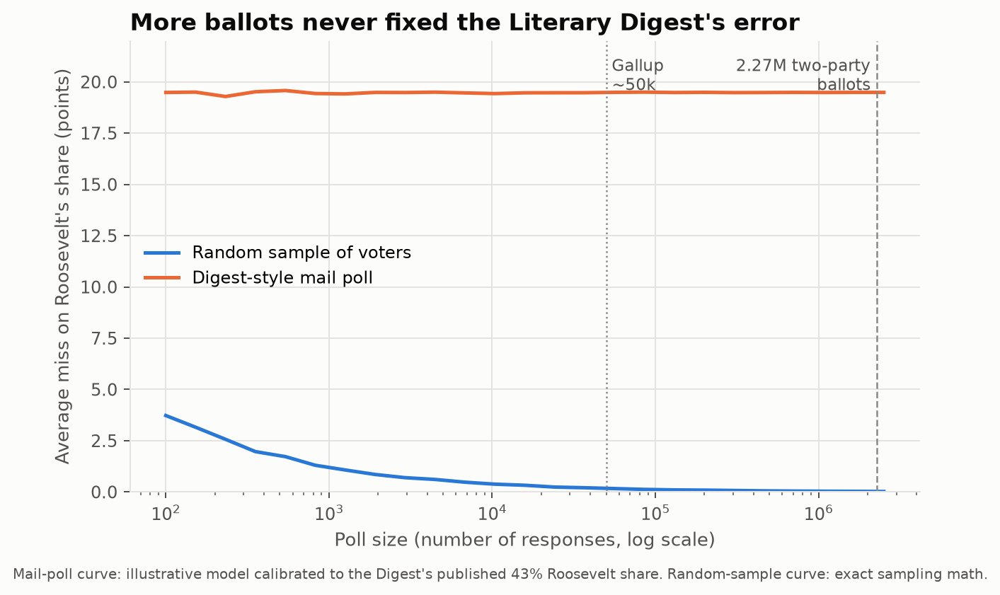
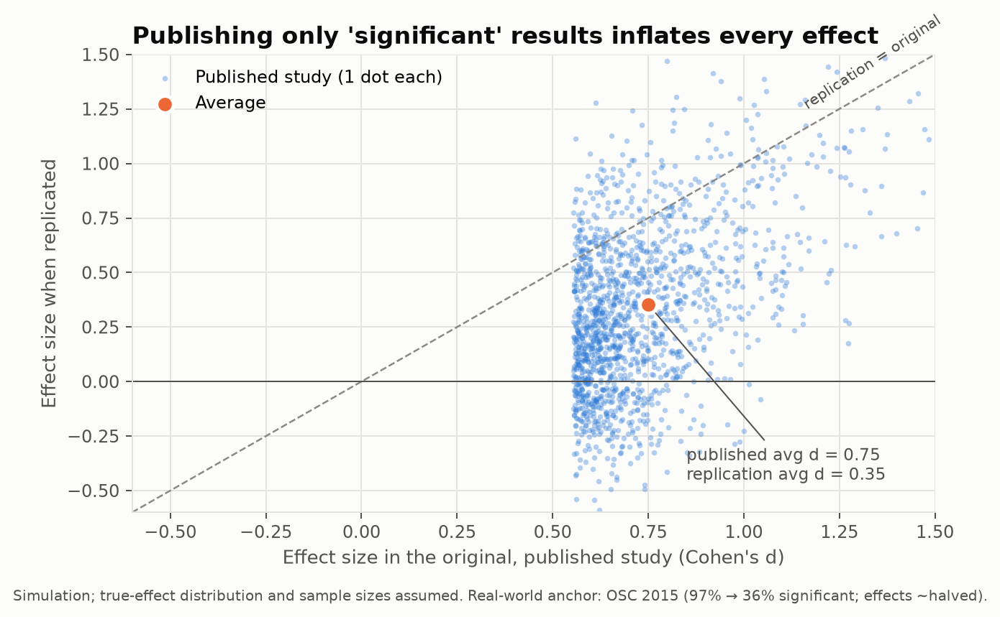

# The Data Only Showed You Who Survived

### Six famous studies, one quiet mistake: the sample chose itself

Every dataset has a bouncer at the door. Before a single number is analysed, something has already decided who gets counted: who answered the survey, which planes came home, which patients chose the pill, which results a journal agreed to print.

When that bouncer is picky in the wrong way, more data doesn't help. It makes the wrong answer more confident.

I re-ran six famous cases in code. Where real data exists, I used the published numbers. Where the real data is the thing we can't observe (the planes that never came home), I simulated it and said what I assumed. All the code is open, and every figure below can be regenerated with one command.

---

## 1. The 2.4-million-person poll that was worth about six people

In 1936 the *Literary Digest* mailed 10 million ballots and got about 2.4 million back. On the two main candidates, the tally was Landon 1,293,669 and Roosevelt 972,897: **42.9% for Roosevelt.** He won with **62.5%** of the two-party vote. The poll missed by **19.6 points.**

Here's the part that surprises people. A random sample of *n* voters has a typical error of √(p(1−p)/n). Set that equal to 19.6 points and solve for *n*:

> **2.27 million biased ballots had the same typical error as a random sample of about 6 voters.**

That isn't a metaphor. It's the arithmetic.

The usual explanation is "they polled rich people with phones and cars." That's part of it. The bigger part, according to later survey analysis (Squire 1988; Lohr & Brick 2017), was **nonresponse**: Landon supporters were much keener to mail their ballot back. In my calibrated model, the biased mailing list gets you to 50% Roosevelt, and differential response drags it down to 43%. Neither problem shrinks when you mail more ballots. George Gallup, with roughly 50,000 responses, called the winner correctly.

**Lesson:** sample size fixes noise. It doesn't fix bias.

---

## 2. Wald's bombers: the holes are where planes could afford to be hit

The story: WWII analysts wanted to armour bombers where returning planes had the most bullet holes. Abraham Wald pointed out that those were the places a plane could be hit and still make it home. The armour belonged where the holes *weren't*.

(Honest footnote: the punchy version is a later retelling. What Wald actually wrote in 1943 was a set of technical memoranda on estimating vulnerability from survivor data, reprinted by Mangel & Samaniego in 1984. The maths is real. The quote isn't.)

I simulated 200,000 sorties. Hits land evenly across the plane by area. A hit to the engine or cockpit is much deadlier than a hit to the wing. Then I looked only at the planes that returned:

On returning planes, engines show **32% fewer holes per square foot** than they really took. Wings show *more* than they really took. A naïve analyst would armour the wrong parts.

The clever bit is that you can *undo* this. Using only the single-hit survivors plus the overall loss rate, Wald's correction recovers per-hit lethality almost exactly: engines 0.40 estimated vs 0.40 true, wings 0.03 vs 0.03.

**Lesson:** missing data isn't random. Sometimes the pattern of what's missing is the finding.

---

## 3. Hormone therapy: millions of prescriptions built on a self-selected sample

Through the 1980s and 90s, large observational studies, including the Nurses' Health Study, found that women on hormone replacement therapy (HRT) had roughly **40–50% less heart disease.** HRT was widely prescribed partly for heart protection.

Then the Women's Health Initiative randomised trial (2002) found the opposite. Estrogen plus progestin *raised* coronary risk: **hazard ratio 1.29** at the early stop, **1.24** in the final adjusted analysis.

What happened? The women who *chose* HRT were, on average, healthier, wealthier, better educated, and more likely to take their pills and see their doctors. Healthy people chose the drug, and the drug got the credit.

I simulated this with HRT's true effect fixed at **harmful (1.24)**. The only thing I added was that healthier women were more likely to opt in:

| Analysis | Risk ratio |
|---|---|
| Observational, raw | **0.55** (looks like 45% protection) |
| Observational, "adjusted" for imperfectly measured health | **0.77** (still looks protective) |
| Randomised trial | **1.23** |
| Truth | 1.24 |

Statistical adjustment closed part of the gap, but it never reversed the sign. You can't adjust for what you didn't measure.

(Purists will call this confounding by self-selection rather than "selection bias" in the strict sense. Same root cause: the people in each group selected themselves.)

**Lesson:** "people who do X are healthier" usually means "healthy people do X."

---

## 4. The hot hand: the famous debunking had a selection bias of its own

This is my favourite, because it flips the usual story.

In 1985 Gilovich, Vallone and Tversky studied basketball shooters and found that players were *no more likely* to hit after a streak of hits than after a streak of misses. "The hot hand is a cognitive illusion" became a textbook example of human irrationality for 30 years.

In 2018, Miller and Sanjurjo (*Econometrica*) proved that the method itself is biased. If you take a finite sequence of shots and look only at the shots that *follow a streak*, you're selecting in a way that under-counts continuations.

Here's the simplest version, which I checked by enumerating all 16 cases. Flip a fair coin 4 times. In each sequence, compute the share of flips after a heads that were also heads. Average across sequences. You get **40.5%, not 50%.**

At realistic sizes (100 shots, streaks of 3), I simulated 200,000 perfectly random 50% shooters:

- Expected hit rate after 3 hits: **46.0%**
- Expected gap (after 3 hits minus after 3 misses): **−7.9 points**

So a truly random shooter *should* look about 8 points colder after streaks. The original study found roughly zero gap, which means shooters were doing better than random after streaks. When Miller and Sanjurjo reanalysed the original data with the bias corrected, they found significant evidence of streak shooting. (The size of the real-world effect is still debated. The direction of the bias is not.)

**Lesson:** the debunkers are made of the same flesh as the debunked.

---

## 5. The birth-weight paradox: smoking that "protects" babies

US vital statistics show something disturbing. Among **low-birth-weight** babies, those born to smoking mothers have *lower* mortality than those born to non-smokers. Read naively, smoking protects small babies.

It doesn't. Hernández-Díaz, Schisterman and Hernán (2006) explained it. Birth weight is caused by smoking *and* by other, far deadlier things such as birth defects. If you restrict your analysis to small babies, a non-smoker's small baby is more likely to be small *because of* the deadlier cause.

I built a model where smoking is harmful in **every** group, with no exceptions, and computed it exactly:

| Group | Risk ratio, smokers vs non-smokers |
|---|---|
| All babies | **1.68** (harmful) |
| Normal birth weight | **1.77** (harmful) |
| Low birth weight only | **0.84** ("protective") |

Among low-birth-weight babies, 16.9% of non-smokers' babies had a defect, against 10.0% of smokers'. That gap alone creates the "protection."

**Lesson:** selecting your sample on an *outcome* of the thing you're studying can invent effects out of nothing. The technical name is collider bias.

---

## 6. The replication crisis: journals are the biggest selection filter of all

In 2015 the Open Science Collaboration re-ran 100 published psychology studies. **97%** of the originals were statistically significant. **36%** of the replications were, and the replicated effects were on average **about half** as large.

You don't need fraud to get this. You only need a filter. I simulated 200,000 small studies of modest real effects (plus some with no effect at all), "published" only those that cleared p < 0.05, and re-ran each published study with a larger sample:

- Only **7.4%** of studies made it through the filter.
- Published average effect: **d = 0.75**. True average effect of those same studies: **d = 0.35**.
- Replication success: **38.6%**. Replication effect: **47%** of the original.
- **1 in 5** published "findings" had a true effect of exactly zero.

Those numbers line up closely with the real 2015 results, and they come from nothing more sinister than *which results got printed.* The gap between the published dots and the diagonal is selection, plain and simple.

**Lesson:** a literature is a sample. Ask who the bouncer was.

---

## The pattern

| Study | Who got filtered out | What it caused |
|---|---|---|
| Literary Digest, 1936 | Roosevelt voters who didn't reply | 20-point miss despite 2.4M ballots |
| WWII bombers | Planes that were shot down | Armour in the wrong place, until corrected |
| HRT observational studies | Less healthy women, who didn't opt in | Harmful drug looked protective |
| Hot hand, 1985 | Continuations, via the streak-selection method | Real effect read as zero |
| Birth-weight paradox | Normal-weight babies | Smoking looked protective |
| Published psychology | Non-significant results | Effects doubled, most failed replication |

Next time a headline says "people who X live longer" or "survey of 1 million finds…", ask one question before anything else:

**Who never made it into the data?**

---

*Code, data sources and full results: [link to repo]. Each analysis is a short Python file. Run `python analysis/run_all.py` to reproduce every number and chart above. Simulated parameters are labelled as assumptions in the code. Only the historical anchors are claimed as real-world facts.*

### Sources
- Squire, P. (1988). Why the 1936 Literary Digest poll failed. *Public Opinion Quarterly* 52(1).
- Lohr, S. & Brick, J. M. (2017). Roosevelt predicted to win: revisiting the 1936 Literary Digest poll. *Statistics, Politics and Policy* 8(1).
- Meng, X.-L. (2018). Statistical paradises and paradoxes in big data (I). *Annals of Applied Statistics* 12(2).
- Mangel, M. & Samaniego, F. (1984). Abraham Wald's work on aircraft survivability. *JASA* 79(386).
- Writing Group for the WHI Investigators (2002). *JAMA* 288(3); Manson, J. E. et al. (2003). *NEJM* 349:523–534.
- Gilovich, T., Vallone, R. & Tversky, A. (1985). *Cognitive Psychology* 17(3).
- Miller, J. B. & Sanjurjo, A. (2018). Surprised by the hot hand fallacy? *Econometrica* 86(6).
- Hernández-Díaz, S., Schisterman, E. & Hernán, M. (2006). The birth weight "paradox" uncovered? *Am J Epidemiol* 164(11).
- Open Science Collaboration (2015). Estimating the reproducibility of psychological science. *Science* 349(6251).
